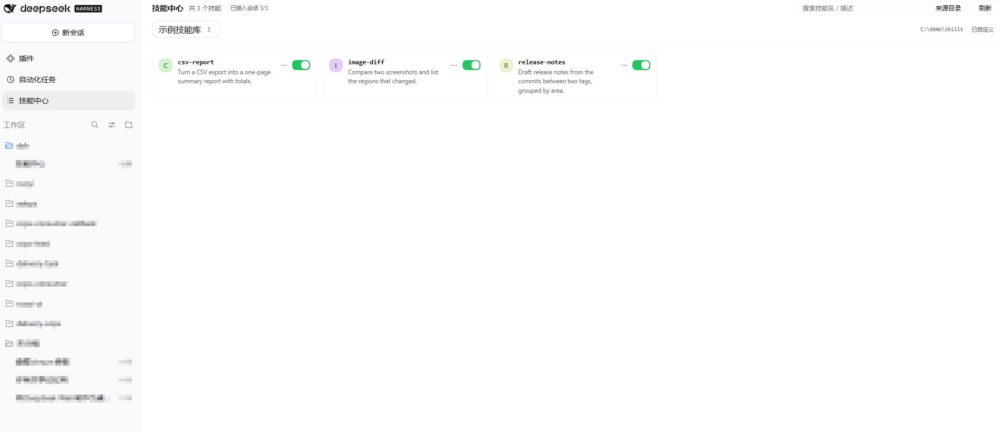

# dsh-skill-center（技能中心）

DSH 侧栏「技能中心」入口 + 中栏技能浏览器：顶部按来源目录分页，技能以卡片分块展示，
卡片上可直接**启用/停用**、通过 **⋯ 菜单打开文件夹**，点击卡片弹出详情框看完整
`SKILL.md`；来源目录本身可在界面里**增删改**并持久化。



## 简介

- **给谁用**：技能（`SKILL.md`）攒了一堆、却只能靠翻文件夹才知道有哪些、开没开的人。
- **解决什么**：技能散在好几个目录里，缺少统一的"看一眼 + 开关"入口；而且当 profile 里
  `@deepseek-ai/dsh-skill-filesystem` 没有激活时（常见情形），`skill` 工具根本列不出这些
  文件型技能 —— 技能放了却调不到。
- **怎么做**：面板只读扫描你配置的技能目录；同时把**启用中**的技能注册进 DSH 的技能表
  （`ctx.skills`），于是**开关键 = 模型能不能看到这个技能**，页头徽标「已接入会话 X/Y」实时显示结果。
- **不做**：不删文件、不移动、不联网、不采集任何数据；唯一的写操作只改该技能 `SKILL.md` 里的
  `disable-model-invocation` 一行（原子写、可逆）。
- **零依赖、免构建**：宿主半区只用 node 内置模块，浏览器半区只用加载器给的 `react`，
  没有第三方包、没有构建步骤，装完即用。

**一眼看懂**：顶部按来源目录分页 → 卡片点开看全文 → 卡片上的开关启用/停用 →「⋯」里打开文件夹。

## 快速开始

```sh
dsh plugin --profile <profile> add github:<owner>/<repo>   # 或 link:<本地路径>
```

装完**刷新页面**即可（首次安装即时生效）；只有改动 `lib/index.js`（宿主半区）才需要重启
DSH 应用。完整的安装 / 卸载（含原始 git URL 与 monorepo 子目录写法）、以及"改代码后怎么生效"，
见下文对应章节。

## 默认来源目录

| 分组 | 目录 | 技能形态 |
| --- | --- | --- |
| **dsh技能** | `%USERPROFILE%\.dsh\skills`（即 `~/.dsh/skills`） | 单文件 `.md` 技能 |
| **workbuddy技能** | `%USERPROFILE%\.workbuddy\skills`（即 `~/.workbuddy/skills`） | 目录 + `SKILL.md` |

以上只是**默认值**：组名（显示名）、id、路径都可在界面里随时改，也可以增删来源目录。

## 功能

- **侧栏入口**：注册在 shell 自己的面板列表（`sidebar.panellist`，`order: 42`）。
- **顶部页签分组**：每个来源目录一个页签（显示名 + 技能数），右侧标出当前根路径与
  来源标记（`内置默认` / `插件配置` / `已自定义`）；搜索只作用于当前页签。
- **卡片分块展示**：自适应网格，每张卡是「首字母头像（同名同色）+ 技能名 + 描述
  （最多 3 行）+ `⋯` 菜单 + 启用开关」；停用的技能显示「已停用」标签并整体降透明度。
- **启用 / 停用**：写 `SKILL.md` frontmatter 的 `disable-model-invocation`
  （停用 → 写入 `true`；启用 → 删掉该行，把文件还原成作者原本的样子；
  文件本来没有 frontmatter 时会补一个最小块）。原子写入（同目录临时文件 + rename），
  保留 BOM、原行尾风格、其余 frontmatter 字段与正文逐字节不变。
- **`⋯` 菜单**（fixed 定位，不会被网格滚动裁剪）：打开文件夹 / 复制路径 / 启用·停用。
  「打开文件夹」由宿主调 `explorer.exe /select,<文件>`（macOS `open -R`、Linux 打开所在目录），
  detached + 无 stdio，不阻塞请求。
- **点击卡片 → 详情弹框**：头部是头像 + 技能名 + 路径 + 大小（超 512KB 标「已截断」）+
  「打开文件夹」按钮；正文是 `SKILL.md` 全文。关闭三条路径：`✕` / 点遮罩 / `Esc`。
- **来源目录编辑器**（页头「来源目录」）：逐行编辑 `id / 显示名 / 路径`，支持新增、
  删除、恢复默认；保存前由宿主校验（id 只允许小写字母数字连字符、路径必须绝对、
  至少一个目录），错误就地显示且不关闭弹框。保存写入 `~/.dsh/skill-center.json`，
  此后它优先于插件 `config.groups`。
  **默认只有两个来源目录**（`~/.dsh/skills` 与 `~/.workbuddy/skills`，见上表），
  但**组名（显示名）、id、路径三样都能改** —— 改名只影响页签文字，路径与技能数不变；
  也可以用下面的 `config.groups` 预设。
- **链接技能只读**：路径上含符号链接 / junction 的技能**可以列出和读取，但拒绝改写**
  （沿技能根逐段检测，因为 junction 里的文件本身 lstat 不是链接），开关自动置灰。
- **零依赖**：宿主半区只用 node 内置模块；浏览器半区只用模块加载器提供的 `react` /
  `react/jsx-runtime`，无 JSX、无第三方包、不需要构建步骤。

## 开启的技能如何被 DSH 会话识别到

宿主半区在挂载时（以及每次「启用/停用」「改来源目录」之后）都会做一次**运行时注册**：

- **启用**的技能 → `ctx.skills.register({ name, description, content, path, source })`；
- **停用** / 改名 / 文件消失的技能 → 调对应 disposer **移出**注册表；
- 界面直接呈现结果：页头徽标 **「已接入会话 X/Y」**（X = 此刻真在技能表里的数量，
  Y = 启用中的总数），卡片上的 **「未接入」** 标签（悬停显示原因）。

为什么不用文件系统 provider：在 `@deepseek-ai/dsh-skill-filesystem` 未激活的 profile 里，
**任何**文件型技能（`.dsh\skills` / `.workbuddy\skills` / `.agents\skills`）都进不了
`skill` 工具的目录（实测）；而运行时注册是 DSH 里既有的另一条通路——不少插件就是这样
把自己的技能送进模型的（例如 `cleverer-dsh/plugins/dsh-skill-provider.mjs`）。
走这条路的好处：不依赖 provider、覆盖任意来源目录（含 `.workbuddy\skills`）、
且**开关直接等于「会话能否看到」**，语义闭环。

细节与边界：

- 技能名优先取 frontmatter 的 `name`，不是 kebab-case 时退回目录名 / 文件名，都不合法才报「未接入」；
- 注册内容剥掉 frontmatter（只注册正文）；没写 `description` 时用正文首行兜底（注册表要求非空）；
- 同名技能只注册第一个，其余标注「未接入：技能名重复」并在界面上给出原因；
- `source` 先试 `runtime`，被注册表拒绝时自动退回 `bundled`（官方 provider 用的取值）；
- 注册表变更对**新会话**立即生效；已开始的会话其技能目录是启动时快照的，不受影响。

## 技能识别口径

与官方 `dsh-skill-filesystem` 的目录约定一致：

- 目录 + 目录内存在 `SKILL.md` → 目录型技能（`kind: dir`），技能名 = 目录名；
- 技能根下的单个 `.md` 文件 → 单文件技能（`kind: file`），技能名 = 文件名去掉 `.md`；
- 目录 / 文件是链接（junction）时同样列出，但标记 `linked: true` 并禁止写；
- 跳过：以 `.` 开头的条目（`.git` / `.claude` / `.trash_*`）、`README.md`、
  以及没有 `SKILL.md` 的目录。

列表项的 `description` / `whenToUse` 取自 frontmatter（零依赖轻量解析，支持 `|` / `>`
块标量），只读文件头 8 KB，不会把 200 KB+ 的技能文件整个读进内存。

## 路由

| 路由 | 方法 | 说明 |
| --- | --- | --- |
| `/api/skill-center/list` | GET | 技能清单（含 `enabled` / `kind` / `folder` / `linked`）+ `source` |
| `/api/skill-center/read?group=&id=` | GET | 单个技能正文（上限 512 KB） |
| `/api/skill-center/set-enabled` | POST | 启用/停用，body `{group,id,enabled}` |
| `/api/skill-center/reveal` | POST | 在系统文件管理器中定位，body `{group,id}` |
| `/api/skill-center/groups` | GET | 当前来源目录 + `source` + `storePath` + `defaults` |
| `/api/skill-center/groups` | POST | 改写来源目录（`{groups:[...]}`）或 `{reset:true}` 恢复默认 |

浏览器半区用**文档相对**路径（`api/skill-center/...`，无前导斜杠）请求：GUI 以
`<base href="./">` 提供服务，根绝对路径会逃出子路径部署前缀。

## 安全模型

- 六条路由都只接受同源 loopback 请求：socket 远端必须是 loopback（127/8、`::1`、
  IPv4-mapped），`Host` 必须是 loopback authority，`Sec-Fetch-Site: cross-site` 拒绝，
  `Origin` 存在时必须与 `Host` 同源；`X-Forwarded-For` 从不信任。
- 写路由（set-enabled / reveal / groups）与读路由**身份只认「最新一次扫描」解析出的
  路径**：客户端传来的 `path` 从不作为凭据，同名但已消失/换位的技能不会被改到别处文件。
- **符号链接 / junction 一律拒绝改写**（`400 linked skill cannot be modified`）：
  原地改写 + rename 会越出技能根。检测沿技能根逐段 lstat，而不是只看最终文件。
- 请求体上限 256 KB；`groups` 的每一行都做 id / label / 绝对路径 / 去重校验。
- 预览用文本节点渲染（`<pre>{content}</pre>`），无 HTML 注入。

## 隐私

- **零遥测、零外发**：宿主半区没有任何对外网络请求；唯一的进程拉起是你在 `⋯` 菜单点
  「打开文件夹」时才执行的本地文件管理器命令。浏览器半区只请求本插件自己的文档相对路由。
- **零凭据**：不读取、不保存任何 token / 密钥 / 账号信息。
- **落盘只有一处**：你自己在「来源目录」里保存的 `%USERPROFILE%\.dsh\skill-center.json`
  （就是来源目录列表）。其余一切都只是**只读扫描**你的技能目录。
- **写操作只在你明确点击时发生**：启用/停用只改该技能 `SKILL.md` 里的
  `disable-model-invocation` 一行（原子写、可逆、已停用时不做无谓写入），**不删任何文件**。

## 安装 / 卸载

```sh
# 安装（link 到本仓库源码）
dsh plugin --profile desktop add link:<仓库路径>/dsh-skill-center

# 卸载
dsh plugin --profile desktop remove dsh-skill-center
```

安装后 profile 的 `package.json` 会多出 `"dsh-skill-center": "link:<仓库路径>/dsh-skill-center"`，
并在 `dsh.profile.bundles` 追加 `dsh-skill-center`；bundle 行由本包 `cordis.patch.yml`
插入（`id: skill-center`）。安装动作对 live profile 即时生效（无需重启）。

### ⚠️ 改代码后的生效方式

| 改动 | 生效方式 |
| --- | --- |
| `lib/client.js`（界面） | 刷新页面（F5）——客户端 bundle 按请求从该文件现取现供 |
| `lib/index.js`（宿主路由） | **必须重启 DSH 应用**，否则跑的还是旧模块 |

宿主侧不能热更新：loader 对同一模块 URL 走 ESM 模块缓存，`set_plugin` 重放条目、
`remove_bundle` + `install_bundle` 都不会重新 import（本机实测三种方式均仍是旧代码，
`/list` 里没有新字段、新路由返回 401）。重启后无需其它操作。

## 测试

```sh
node tests/host-scan.test.mjs      # 宿主：扫描口径 + 夹具写入 + 围栏/错误路径
node tests/skill-bridge.test.mjs   # 会话可见性 ↔ 启用开关（运行时注册桥）
node tests/client-render.test.mjs  # 端到端：伪 loader/react/slots 渲染真实客户端半区
```

三个测试都用 `tests/_harness.mjs`，且**全部夹具驱动**：写操作落在 `mkdtemp` 出来的
临时目录里（`DSH_SKILL_CENTER_STORE` 指向临时 store、`DSH_SKILL_CENTER_NO_SPAWN=1`
让 reveal 只回命令），断言里不写死任何本机技能名或数量——因此跑测试既不碰真实技能，
也能在任何机器上通过。

覆盖：目录扫描口径（含 junction / 无 frontmatter）、停用写入与启用还原、
符号链接拒绝改写、reveal 命令构造、来源目录读写与校验与优先级、
页签分组、卡片数与开关、⋯ 菜单三动作、详情弹框与三条关闭路径、搜索过滤。

`client-render` 的伪 hooks 会按 deps 重跑 effect 并执行 cleanup（贴近 React），
因此 `document` 级 Esc 监听也被真实驱动；所有断言都基于夹具技能（`alpha` / `beta` /
`linked` / 重名夹具），不依赖任何本机技能库内容。

## 配置（可选）

`config.groups` 可作为来源目录的**默认值**（被界面里保存的 `~/.dsh/skill-center.json`
覆盖）；不配置也不影响使用：

```yaml
- id: skill-center
  name: 'dsh-skill-center'
  config:
    enabled: true
    groups:
      - id: dsh
        label: dsh技能
        root: 'C:\Users\<用户名>\.dsh\skills'
```

## 实测结论（2026-09-30 · 重启后）

`node tests/live-verify.mjs` 对着运行中的 GUI 打真实 HTTP（本机实测全部检查通过）：

- 宿主半区已加载新代码：`list` 返回 `source=default`，技能字段含
  `kind / folder / enabled / disabled / linked`；默认两组 `dsh技能` / `workbuddy技能`（数量随各人技能库而定）。
- `GET/POST /groups`：保存后 `source=file` 并写出
  `%USERPROFILE%\.dsh\skill-center.json`；`reset` 后回到 `default` 两组。
- `POST /set-enabled`：真实写入 `disable-model-invocation: true`（正文与其他 frontmatter
  字段逐字保留），`list` 立刻反映 `enabled=false`；再启用后文件**逐字节还原**。
- `POST /reveal`：返回 `explorer.exe /select,<…>\live-demo\SKILL.md`，**真的弹出了资源管理器**。
- 客户端 `sidebar.panellist` 与 `main` 两个座位的 `skill-center`（`order: 42`）均为
  `active: true`。

验证脚本只在系统临时目录里新建夹具技能，两个真实技能目录**仅被读取**；
结束时一定会 `reset` 还原来源目录（用 `finally` 兜底）。

> 注：若同时安装了其它同样注册 `sidebar.panellist` / `main` 的技能面板插件（例如
> `@linxin666/dsh-client-ui-skill-explorer`），侧栏会出现两个同名「技能中心」入口，
> 改一个 id 或停用其一即可。

### 会话可见性（运行时技能桥）

- 启用中的技能全部注册进 `ctx.skills`（`source=runtime`，无重名冲突时 100% 注册）。
- 停用 → 立刻退出会话技能表（`registered=false` 且 disposer 已调）；启用 → 立刻挂回。
- 无 frontmatter 的单文件技能（fixture `beta.md`）：正文兜底出 `description` 后正常注册。
- 同名技能：只注册第一个，另一个带原因（界面显示「未接入」）。
- `source` 兼容性：把注册表限制为只接受 `bundled` 时自动退回，仍全部注册成功。
- 认证方式：`node tests/skill-bridge.test.mjs`（无需浏览器/无需重启）。
